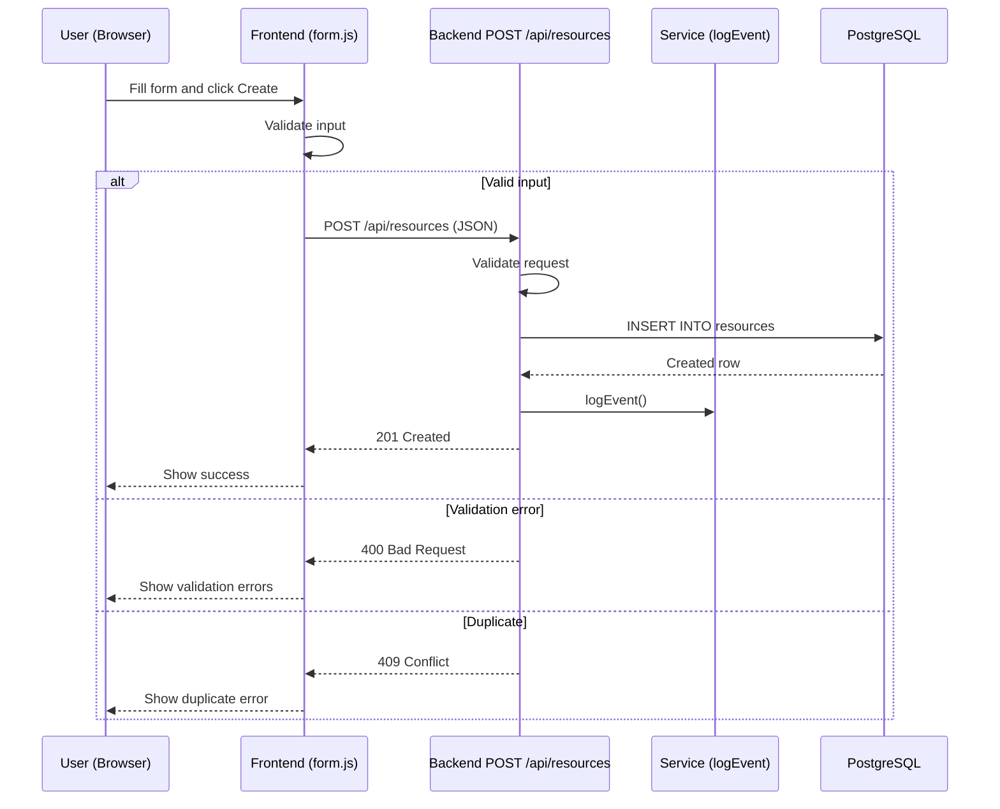
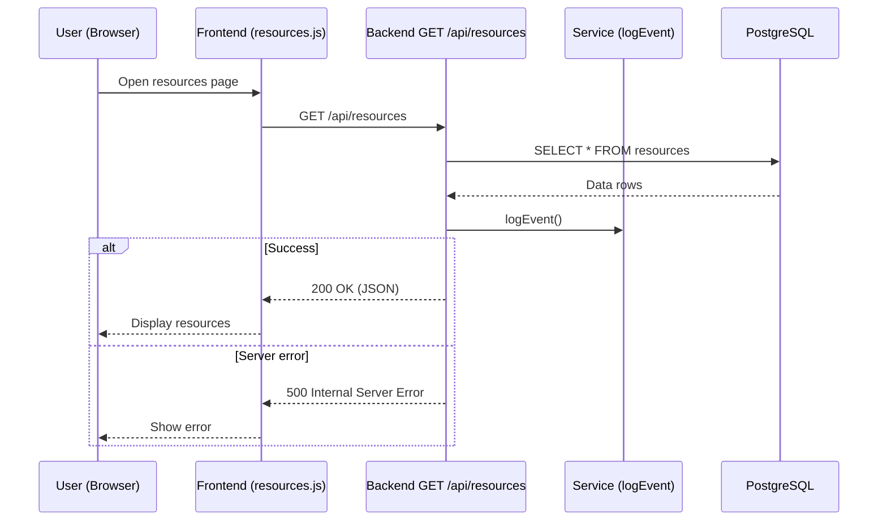
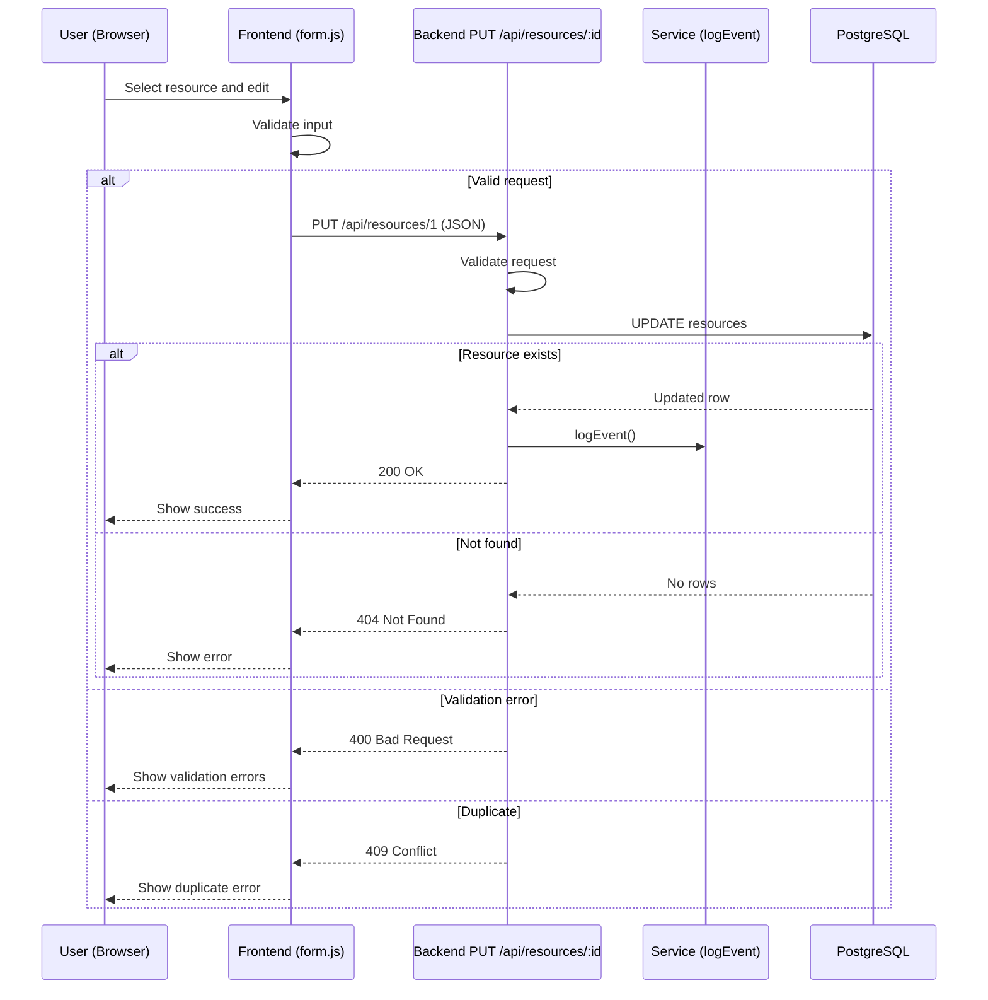
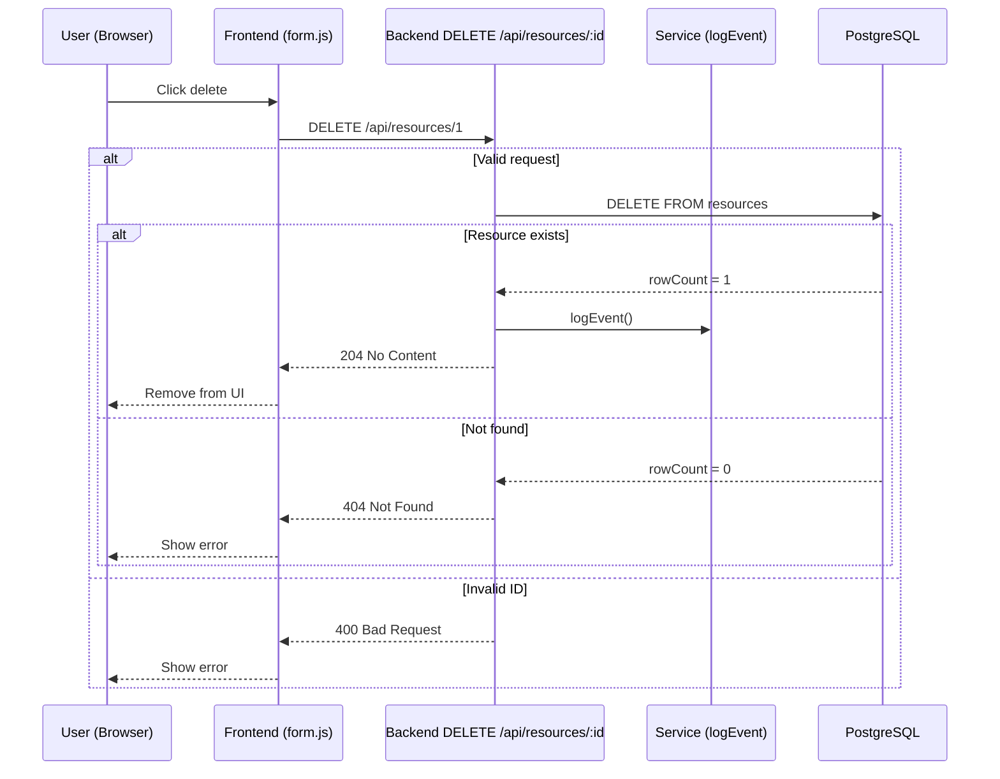

 # 📘 G1: CRUD Data Flow (Phase6)

---

## 🟢 CREATE (C)

```mermaid
sequenceDiagram
    participant U as User (Browser)
    participant F as Frontend (form.js)
    participant B as Backend POST /api/resources
    participant S as Service (logEvent)
    participant DB as PostgreSQL

    U->>F: Fill form and click Create
    F->>F: Validate input

    alt Valid input
        F->>B: POST /api/resources (JSON)
        B->>B: Validate request
        B->>DB: INSERT INTO resources
        DB-->>B: Created row
        B->>S: logEvent()
        B-->>F: 201 Created
        F-->>U: Show success

    else Validation error
        B-->>F: 400 Bad Request
        F-->>U: Show validation errors

    else Duplicate
        B-->>F: 409 Conflict
        F-->>U: Show duplicate error
    end
```

---

## 🔵 READ (R)

```mermaid
 sequenceDiagram
    participant U as User (Browser)
    participant F as Frontend (resources.js)
    participant B as Backend GET /api/resources
    participant S as Service (logEvent)
    participant DB as PostgreSQL

    U->>F: Open resources page
    F->>B: GET /api/resources

    B->>DB: SELECT * FROM resources
    DB-->>B: Data rows
    B->>S: logEvent()

    alt Success
        B-->>F: 200 OK (JSON)
        F-->>U: Display resources

    else Server error
        B-->>F: 500 Internal Server Error
        F-->>U: Show error
    end
```

---

## 🟡 UPDATE (U)

```mermaid
sequenceDiagram
    participant U as User (Browser)
    participant F as Frontend (form.js)
    participant B as Backend PUT /api/resources/:id
    participant S as Service (logEvent)
    participant DB as PostgreSQL

    U->>F: Select resource and edit
    F->>F: Validate input

    alt Valid request
        F->>B: PUT /api/resources/1 (JSON)
        B->>B: Validate request
        B->>DB: UPDATE resources

        alt Resource exists
            DB-->>B: Updated row
            B->>S: logEvent()
            B-->>F: 200 OK
            F-->>U: Show success

        else Not found
            DB-->>B: No rows
            B-->>F: 404 Not Found
            F-->>U: Show error
        end

    else Validation error
        B-->>F: 400 Bad Request
        F-->>U: Show validation errors

    else Duplicate
        B-->>F: 409 Conflict
        F-->>U: Show duplicate error
    end
```

---

## 🔴 DELETE (D)

```mermaid
sequenceDiagram
    participant U as User (Browser)
    participant F as Frontend (form.js)
    participant B as Backend DELETE /api/resources/:id
    participant S as Service (logEvent)
    participant DB as PostgreSQL

    U->>F: Click delete
    F->>B: DELETE /api/resources/1

    alt Valid request
        B->>DB: DELETE FROM resources

        alt Resource exists
            DB-->>B: rowCount = 1
            B->>S: logEvent()
            B-->>F: 204 No Content
            F-->>U: Remove from UI

        else Not found
            DB-->>B: rowCount = 0
            B-->>F: 404 Not Found
            F-->>U: Show error
        end

    else Invalid ID
        B-->>F: 400 Bad Request
        F-->>U: Show error
    end
```

---
